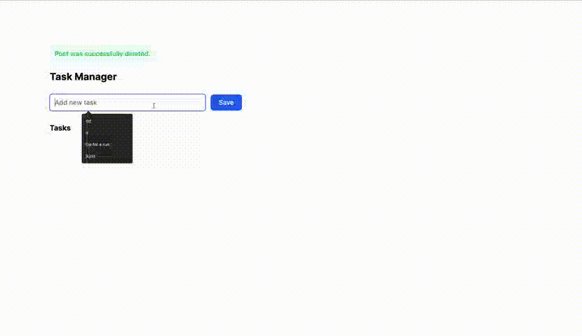

# 30 Days of Hotwire 🔥
Just something I'm doing while recovering from burnout. I decided I will only work with tech I enjoy. Rails + Hotwire is one of them.

- Turbo: Reduces the amount of JS we must write.
  - Drive: for links and form submissions. Updates the page w/o a reload. 
    - Intercepts all clicks on links and forms so the page doesn't realod.
      - This is activated by default is Rails 7.
    - It replaces everything within the `<body></body>`. 
  - Frames: Divides pages so that the context of our actions stay within that frame. 
    - Does not replace the entire body like Turbo Drive, only the part that changed. It reduces the amount of HTML you must send over the wire.
    - Each frame must have a unique ID. 
    - A page can have multiple turbo frames. 
  - Streams: Page changes via Websockets.
Stimulus: for the small JS interactivity.
Strada: to allow our Rails apps to become Native apps.

# 1. ToDo

Just a simple Rails application showcasing a ToDo application. I am recovering from burnout so naturally a ToDo app is the simplest way to get started. Hotwire is a really cool way to build Web Apps...I was using everything from React + Node, React w/ Rails API, Ember...none of them made total sense to me as to why we were't using something like Hotwire/Django to create applications. 

## Learned About
- Turbo Drive: Replacing the body during link/form submissions
- Turbo Frames: Replacing a specified portion of the page.
- Stimulus (Just a sprinkle): submitting the form to a Rails controller.
- ERB: Default templating engine
- SQLite3: Database stuff

# 2. Basic Hotwire

This one is just using Turbo Streams in the console. I learned about the Pub/Sub model that streams have to offer. It's pretty neat to configure. On day 3 I'll create something that uses Turbo Drive, Frames, Stimulus, Streams just to showcase something.

## Learned About
- Turbo Streams: Hotwire's way of using WebSockets.
